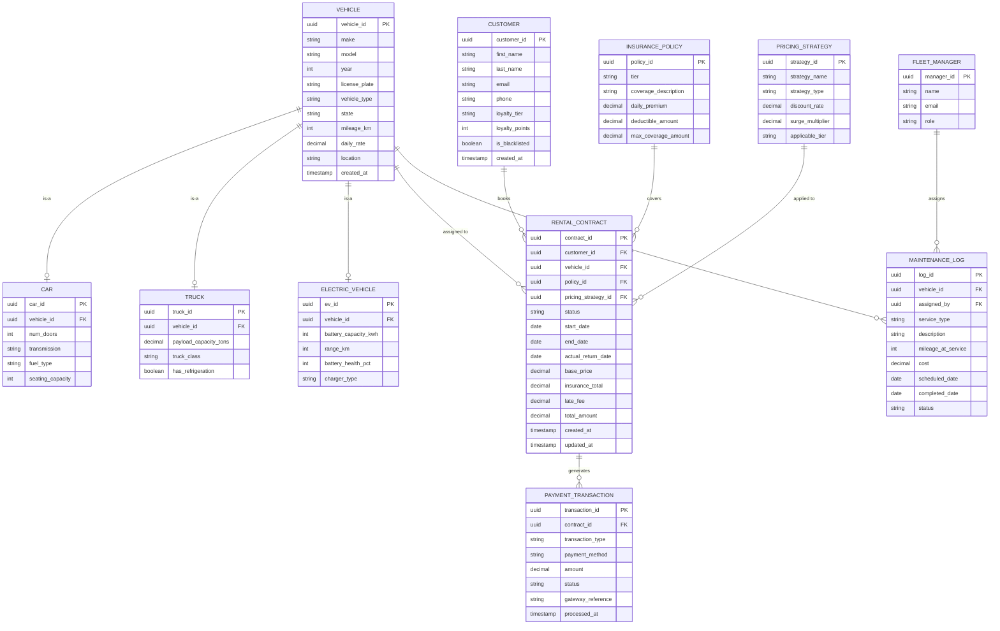

# DriveFlow — Entity Relationship Diagram

## Diagram

---

## Relationship Summary

| Relationship | Cardinality | Description |
|---|---|---|
| `VEHICLE` → `CAR` | 1:0..1 | A vehicle may be specialized as a Car |
| `VEHICLE` → `TRUCK` | 1:0..1 | A vehicle may be specialized as a Truck |
| `VEHICLE` → `ELECTRIC_VEHICLE` | 1:0..1 | A vehicle may be specialized as an EV |
| `CUSTOMER` → `RENTAL_CONTRACT` | 1:N | A customer can have many rental contracts |
| `VEHICLE` → `RENTAL_CONTRACT` | 1:N | A vehicle can appear in many contracts (over time) |
| `INSURANCE_POLICY` → `RENTAL_CONTRACT` | 1:N | One policy type can be used across many contracts |
| `PRICING_STRATEGY` → `RENTAL_CONTRACT` | 1:N | A strategy can be applied to many contracts |
| `RENTAL_CONTRACT` → `PAYMENT_TRANSACTION` | 1:N | A contract generates multiple transactions (hold, charge, refund) |
| `VEHICLE` → `MAINTENANCE_LOG` | 1:N | A vehicle has a full maintenance history |
| `FLEET_MANAGER` → `MAINTENANCE_LOG` | 1:N | A manager can assign many maintenance tasks |

---

## Notes

- **Vehicle Inheritance**: Implemented as a **Table-Per-Type (TPT)** strategy — the `VEHICLE` table holds common fields; `CAR`, `TRUCK`, and `ELECTRIC_VEHICLE` tables hold type-specific fields linked via FK.
- **Pricing Strategy**: Stored as a reference table; the actual algorithm lives in the application layer (Strategy Pattern).
- **Rental Contract Status**: Managed by the application's State Machine — values: `DRAFT`, `CONFIRMED`, `ACTIVE`, `COMPLETED`, `CANCELLED`.
- **Payment Transaction Types**: `HOLD`, `CHARGE`, `LATE_FEE`, `REFUND`, `DAMAGE_FEE`.
