# DriveFlow — Class Diagram

## Diagram

```mermaid
classDiagram
    direction TB

    %% ─────────────────────────────────────────
    %% VEHICLE HIERARCHY (Inheritance)
    %% ─────────────────────────────────────────

    class Vehicle {
        <<abstract>>
        -UUID vehicleId
        -String make
        -String model
        -int year
        -String licensePlate
        -int mileageKm
        -BigDecimal dailyRate
        -String location
        -VehicleState state
        +getVehicleId() UUID
        +getState() VehicleState
        +setState(VehicleState) void
        +updateMileage(int) void
        +isAvailable() boolean
        +getVehicleType()* String
        +getSpecifications()* Map
    }

    class Car {
        -int numDoors
        -String transmission
        -String fuelType
        -int seatingCapacity
        +getVehicleType() String
        +getSpecifications() Map
    }

    class Truck {
        -double payloadCapacityTons
        -String truckClass
        -boolean hasRefrigeration
        +getVehicleType() String
        +getSpecifications() Map
        +getPayloadCapacity() double
    }

    class ElectricVehicle {
        -int batteryCapacityKwh
        -int rangeKm
        -int batteryHealthPct
        -String chargerType
        +getVehicleType() String
        +getSpecifications() Map
        +getBatteryStatus() BatteryStatus
        +estimateRange() int
    }

    Vehicle <|-- Car
    Vehicle <|-- Truck
    Vehicle <|-- ElectricVehicle

    %% ─────────────────────────────────────────
    %% FACTORY PATTERN
    %% ─────────────────────────────────────────

    class VehicleFactory {
        <<factory>>
        +create(VehicleType, VehicleSpec) Vehicle$
        -createCar(VehicleSpec) Car$
        -createTruck(VehicleSpec) Truck$
        -createEV(VehicleSpec) ElectricVehicle$
    }

    class VehicleType {
        <<enumeration>>
        CAR
        TRUCK
        ELECTRIC_VEHICLE
    }

    VehicleFactory ..> Car : creates
    VehicleFactory ..> Truck : creates
    VehicleFactory ..> ElectricVehicle : creates
    VehicleFactory ..> VehicleType : uses

    %% ─────────────────────────────────────────
    %% STATE PATTERN
    %% ─────────────────────────────────────────

    class VehicleState {
        <<interface>>
        +reserve(Vehicle) void
        +activate(Vehicle) void
        +returnVehicle(Vehicle) void
        +sendToMaintenance(Vehicle) void
        +retire(Vehicle) void
        +getStateName() String
    }

    class AvailableState {
        +reserve(Vehicle) void
        +activate(Vehicle) void
        +returnVehicle(Vehicle) void
        +sendToMaintenance(Vehicle) void
        +retire(Vehicle) void
        +getStateName() String
    }

    class ReservedState {
        +reserve(Vehicle) void
        +activate(Vehicle) void
        +returnVehicle(Vehicle) void
        +sendToMaintenance(Vehicle) void
        +retire(Vehicle) void
        +getStateName() String
    }

    class RentedState {
        +reserve(Vehicle) void
        +activate(Vehicle) void
        +returnVehicle(Vehicle) void
        +sendToMaintenance(Vehicle) void
        +retire(Vehicle) void
        +getStateName() String
    }

    class MaintenanceState {
        +reserve(Vehicle) void
        +activate(Vehicle) void
        +returnVehicle(Vehicle) void
        +sendToMaintenance(Vehicle) void
        +retire(Vehicle) void
        +getStateName() String
    }

    class RetiredState {
        +reserve(Vehicle) void
        +activate(Vehicle) void
        +returnVehicle(Vehicle) void
        +sendToMaintenance(Vehicle) void
        +retire(Vehicle) void
        +getStateName() String
    }

    VehicleState <|.. AvailableState
    VehicleState <|.. ReservedState
    VehicleState <|.. RentedState
    VehicleState <|.. MaintenanceState
    VehicleState <|.. RetiredState
    Vehicle o-- VehicleState : "current state"

    %% ─────────────────────────────────────────
    %% STRATEGY PATTERN
    %% ─────────────────────────────────────────

    class PricingStrategy {
        <<interface>>
        +calculatePrice(RentalContract) BigDecimal
        +getStrategyName() String
    }

    class StandardPricingStrategy {
        +calculatePrice(RentalContract) BigDecimal
        +getStrategyName() String
    }

    class WeeklyDiscountStrategy {
        -double discountRate
        +calculatePrice(RentalContract) BigDecimal
        +getStrategyName() String
    }

    class LoyaltyPricingStrategy {
        -Map~LoyaltyTier, Double~ tierDiscounts
        +calculatePrice(RentalContract) BigDecimal
        +getStrategyName() String
    }

    class SeasonalSurgePricingStrategy {
        -double surgeMultiplier
        -List~DateRange~ peakPeriods
        +calculatePrice(RentalContract) BigDecimal
        +getStrategyName() String
        -isInPeakSeason(LocalDate) boolean
    }

    PricingStrategy <|.. StandardPricingStrategy
    PricingStrategy <|.. WeeklyDiscountStrategy
    PricingStrategy <|.. LoyaltyPricingStrategy
    PricingStrategy <|.. SeasonalSurgePricingStrategy

    %% ─────────────────────────────────────────
    %% CUSTOMER
    %% ─────────────────────────────────────────

    class Customer {
        -UUID customerId
        -String firstName
        -String lastName
        -String email
        -String phone
        -LoyaltyTier loyaltyTier
        -int loyaltyPoints
        -boolean isBlacklisted
        +getCustomerId() UUID
        +getLoyaltyTier() LoyaltyTier
        +addLoyaltyPoints(int) void
        +upgradeTier() void
        +isEligibleToRent() boolean
    }

    class LoyaltyTier {
        <<enumeration>>
        BRONZE
        SILVER
        GOLD
        PLATINUM
    }

    Customer --> LoyaltyTier

    %% ─────────────────────────────────────────
    %% RENTAL CONTRACT (Core Aggregate)
    %% ─────────────────────────────────────────

    class RentalContract {
        -UUID contractId
        -ContractStatus status
        -LocalDate startDate
        -LocalDate endDate
        -LocalDate actualReturnDate
        -BigDecimal basePrice
        -BigDecimal insuranceTotal
        -BigDecimal lateFee
        -BigDecimal totalAmount
        +getContractId() UUID
        +confirm() void
        +activate() void
        +complete() void
        +cancel() void
        +calculateTotalPrice() BigDecimal
        +calculateLateFee() BigDecimal
        +getRentalDurationDays() int
        +isOverdue() boolean
    }

    class ContractStatus {
        <<enumeration>>
        DRAFT
        CONFIRMED
        ACTIVE
        COMPLETED
        CANCELLED
    }

    RentalContract --> ContractStatus
    RentalContract --> Customer : "booked by"
    RentalContract --> Vehicle : "for vehicle"
    RentalContract --> InsurancePolicy : "covered by"
    RentalContract o-- PricingStrategy : "priced with"

    %% ─────────────────────────────────────────
    %% INSURANCE POLICY
    %% ─────────────────────────────────────────

    class InsurancePolicy {
        -UUID policyId
        -InsuranceTier tier
        -String coverageDescription
        -BigDecimal dailyPremium
        -BigDecimal deductibleAmount
        -BigDecimal maxCoverageAmount
        +getPolicyId() UUID
        +getTier() InsuranceTier
        +getDailyPremium() BigDecimal
        +isEligibleForVehicle(Vehicle) boolean
    }

    class InsuranceTier {
        <<enumeration>>
        BASIC
        STANDARD
        PREMIUM
        FULL_COVERAGE
    }

    InsurancePolicy --> InsuranceTier

    %% ─────────────────────────────────────────
    %% MAINTENANCE LOG
    %% ─────────────────────────────────────────

    class MaintenanceLog {
        -UUID logId
        -String serviceType
        -String description
        -int mileageAtService
        -BigDecimal cost
        -LocalDate scheduledDate
        -LocalDate completedDate
        -MaintenanceStatus status
        +getLogId() UUID
        +markCompleted(LocalDate) void
        +getStatus() MaintenanceStatus
    }

    class MaintenanceStatus {
        <<enumeration>>
        SCHEDULED
        IN_PROGRESS
        COMPLETED
        CANCELLED
    }

    MaintenanceLog --> MaintenanceStatus
    Vehicle "1" --> "0..*" MaintenanceLog : "has history"

    %% ─────────────────────────────────────────
    %% PAYMENT TRANSACTION
    %% ─────────────────────────────────────────

    class PaymentTransaction {
        -UUID transactionId
        -TransactionType type
        -PaymentMethod paymentMethod
        -BigDecimal amount
        -TransactionStatus status
        -String gatewayReference
        -LocalDateTime processedAt
        +getTransactionId() UUID
        +process() void
        +refund() void
        +getStatus() TransactionStatus
    }

    class TransactionType {
        <<enumeration>>
        HOLD
        CHARGE
        LATE_FEE
        REFUND
        DAMAGE_FEE
    }

    PaymentTransaction --> TransactionType
    RentalContract "1" --> "0..*" PaymentTransaction : "generates"
```

---

## Pattern Highlights

| Pattern | Interface / Class | Role |
|---|---|---|
| **State** | `VehicleState` | Controls valid transitions for each vehicle lifecycle stage |
| **Strategy** | `PricingStrategy` | Swappable pricing algorithm injected into `RentalContract` |
| **Factory** | `VehicleFactory` | Encapsulates creation logic for `Car`, `Truck`, `ElectricVehicle` |
| **Inheritance** | `Vehicle` → subclasses | Shared fields in abstract base; type-specific fields in subclasses |
| **Composition** | `RentalContract` | Aggregates Customer, Vehicle, InsurancePolicy, PricingStrategy |

---

## Key Design Decisions

1. **`Vehicle` is abstract** — you cannot instantiate a bare vehicle; you must use the factory.
2. **`VehicleState` is an interface** — each state is a self-contained class that knows which transitions are valid and which throw `IllegalStateTransitionException`.
3. **`PricingStrategy` is injected** into `RentalContract` at booking time — the contract doesn't know which algorithm is running.
4. **`RentalContract` is the aggregate root** — all business rules (price calculation, late fee, status transitions) live here.
5. **Enumerations** (`LoyaltyTier`, `InsuranceTier`, `ContractStatus`, etc.) enforce valid domain values at compile time.
