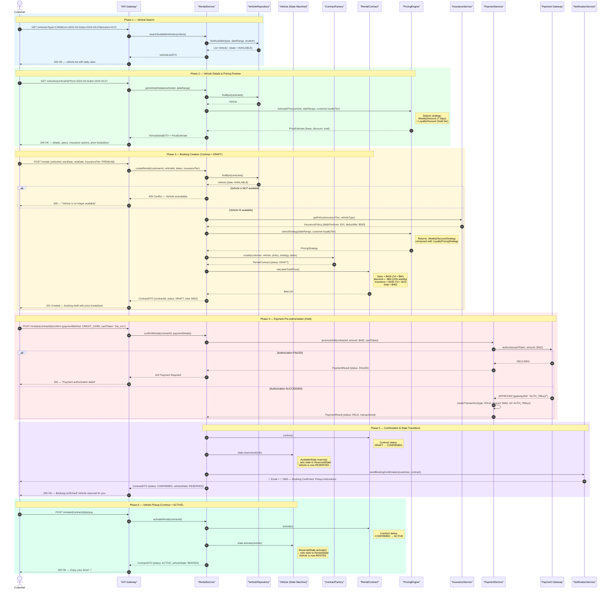

# DriveFlow — Sequence Diagram: "Rent a Vehicle" Workflow

## Workflow Overview

This diagram covers the complete **"Rent a Vehicle"** flow:
1. Customer searches for available vehicles
2. Vehicle details and pricing are retrieved
3. Customer creates a booking (RentalContract enters Draft state)
4. Insurance policy is selected
5. Pricing strategy is applied
6. Payment hold (pre-authorization) is processed
7. Contract is confirmed and vehicle state transitions to Reserved
8. Customer picks up the vehicle → state transitions to Rented

---

## Diagram

---

## State Transition Summary

| Phase | RentalContract Status | Vehicle State |
|---|---|---|
| Search | — | `AVAILABLE` |
| Draft Created | `DRAFT` | `AVAILABLE` |
| Payment Held | `DRAFT` | `AVAILABLE` |
| Confirmed | `CONFIRMED` | `RESERVED` |
| Picked Up | `ACTIVE` | `RENTED` |
| Returned | `COMPLETED` | `AVAILABLE` or `MAINTENANCE` |
| Cancelled | `CANCELLED` | `AVAILABLE` |

---

## Design Pattern Interactions in This Flow

| Pattern | Where Applied |
|---|---|
| **State Pattern** | `Vehicle.state.reserve()` and `Vehicle.state.activate()` — each state validates and executes the transition |
| **Strategy Pattern** | `PricingEngine.selectStrategy()` returns the correct `PricingStrategy` implementation; `RentalContract.calculateTotalPrice()` delegates to it |
| **Factory Pattern** | `ContractFactory.create()` assembles the `RentalContract` aggregate with all dependencies |
