# DriveFlow — Use Case Diagram

## Actors

- **Customer** — Registers, browses vehicles, books rentals, selects insurance, makes payments
- **Fleet Manager** — Manages fleet inventory, assigns maintenance, monitors vehicle states
- **System** — Automated processes: late fee calculation, maintenance triggers, payment holds

---

## Diagram

```mermaid
%%{init: {"theme": "default"}}%%
graph TD
    Customer(["👤 Customer"])
    FleetManager(["👤 Fleet Manager"])
    System(["⚙️ System"])

    subgraph DriveFlow System

        UC1["Register / Login"]
        UC2["Browse Available Vehicles"]
        UC3["Filter Vehicles by Type & Date"]
        UC4["View Vehicle Details"]
        UC5["Create Rental Booking"]
        UC6["Select Insurance Policy"]
        UC7["Apply Loyalty Discount"]
        UC8["Confirm & Pay Deposit"]
        UC9["Process Payment Hold"]
        UC10["Pick Up Vehicle"]
        UC11["Return Vehicle"]
        UC12["Calculate Final Charges"]
        UC13["Process Late Fees"]
        UC14["Issue Refund"]
        UC15["View Rental History"]
        UC16["Manage Fleet Inventory"]
        UC17["Add / Update Vehicle"]
        UC18["View Vehicle State"]
        UC19["Assign Maintenance Task"]
        UC20["Log Maintenance Record"]
        UC21["Trigger Maintenance Alert"]
        UC22["Generate Fleet Report"]
        UC23["Monitor Overdue Maintenance"]

    end

    %% Customer interactions
    Customer --> UC1
    Customer --> UC2
    Customer --> UC5
    Customer --> UC10
    Customer --> UC11
    Customer --> UC15

    %% Fleet Manager interactions
    FleetManager --> UC16
    FleetManager --> UC17
    FleetManager --> UC18
    FleetManager --> UC19
    FleetManager --> UC22
    FleetManager --> UC23

    %% System automated interactions
    System --> UC9
    System --> UC12
    System --> UC13
    System --> UC21

    %% include relationships
    UC2 -.->|"<<include>>"| UC3
    UC2 -.->|"<<include>>"| UC4
    UC5 -.->|"<<include>>"| UC6
    UC5 -.->|"<<include>>"| UC8
    UC8 -.->|"<<include>>"| UC9
    UC11 -.->|"<<include>>"| UC12
    UC19 -.->|"<<include>>"| UC20
    UC16 -.->|"<<include>>"| UC18

    %% extend relationships
    UC5 -.->|"<<extend>>"| UC7
    UC12 -.->|"<<extend>>"| UC13
    UC12 -.->|"<<extend>>"| UC14
    UC21 -.->|"<<extend>>"| UC19
```

---

## Use Case Descriptions

### Customer Use Cases

| Use Case | Description |
|---|---|
| Register / Login | Customer creates an account or authenticates via JWT/OAuth |
| Browse Available Vehicles | View fleet filtered by availability for selected dates |
| Filter Vehicles by Type & Date | Narrow results by Car/Truck/EV, location, capacity |
| View Vehicle Details | See specs, daily rate, insurance options, current state |
| Create Rental Booking | Initiate a RentalContract (Draft state) |
| Select Insurance Policy | Choose Basic / Standard / Premium / Full Coverage |
| Apply Loyalty Discount | System applies tier discount if customer qualifies |
| Confirm & Pay Deposit | Customer authorizes payment hold |
| Pick Up Vehicle | Vehicle transitions: Reserved → Rented |
| Return Vehicle | Vehicle transitions: Rented → Available (or Maintenance) |
| View Rental History | Browse past contracts and invoices |

### Fleet Manager Use Cases

| Use Case | Description |
|---|---|
| Manage Fleet Inventory | CRUD operations on the vehicle fleet |
| Add / Update Vehicle | Register new vehicle or update specs/status |
| View Vehicle State | Monitor real-time state of each vehicle |
| Assign Maintenance Task | Schedule a service window for a vehicle |
| Log Maintenance Record | Record completed maintenance with details |
| Generate Fleet Report | Export utilization, revenue, and maintenance reports |
| Monitor Overdue Maintenance | View vehicles past their service threshold |

### System Automated Use Cases

| Use Case | Description |
|---|---|
| Process Payment Hold | Pre-authorize deposit on booking confirmation |
| Calculate Final Charges | Compute total on return (base + extras + late fees) |
| Process Late Fees | Detect overdue returns and apply penalty rates |
| Trigger Maintenance Alert | Notify Fleet Manager when mileage/time threshold crossed |

---

## Key Relationships

- **`<<include>>`** — Mandatory sub-flow always executed as part of the parent use case
  - e.g., "Create Rental Booking" always includes "Select Insurance Policy"
- **`<<extend>>`** — Optional or conditional sub-flow
  - e.g., "Calculate Final Charges" extends with "Process Late Fees" only if return is overdue
  - e.g., "Create Rental Booking" extends with "Apply Loyalty Discount" only for Silver+ customers
